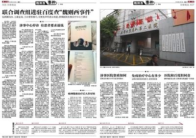

# 正确认识IT中的伦理与道德

## 关于IT产业中“抄袭问题的认识”

中国著作权法明确规定计算机软件主要是由代码组成的，对于计算机软件，同样享有著作权，未经著作权人许可，不得擅自使用，否则会承担法律责任。

因此，优秀的程序员页要不光要学习好的计算机知识，一定的法律意识也是必不可少的。

## 关于IT产业中合理竞争的认识

腾讯与360之争为2010年中国互联网产业的重点热门事件，吸引了众多媒体的关注与网络上的诸多讨论，甚至引起了中央的重视。IT产业中合理竞争逐渐引发了讨论。

“这场战斗还将持续，我们坚信必将赢得用户的支持，打赢这场战斗。” ——腾讯公司董事局主席马化腾。

“腾讯这个横行的霸权即使要倾轧过360的身躯，360也一定要让这个恶霸付出代价，这就是腾讯必须要把知情权和选择权交还给亿万用户。” ——奇虎360董事长周鸿祎。

双方博弈剥夺了用户选择与信任，严重影响各企业声誉，扰乱市场秩序，引发一连串社会反应。

通过腾讯与360之争，大家更加关注网络世界不正当竞争。现在网络的不正当竞争已经发生了很大的改变，隐蔽性越来越强，杀伤性越来越大，问题越来越复杂。针对这种情况，政府应当在尊重市场规律的前提下，监督市场运作，制止恶性竞争，进行适当的引导，维护网络市场的健康进展。

## 关于IT产业中程序员“利益”与“良心”的认识

此前在网络上引起热议的360全家桶，百度全家桶，QQ全家桶等等产品，似乎引发了顾客的不满，而作为这些产品的开发者——程序员们则成了顾客议论重点对象。部分人认为：这不是程序员的错，程序员也是为了生存，他们只是按照上级的要求，真正错的领导；而另一部分人则不然，他们认为这些程序员为了利益涨昏了头脑。

理性认识程序员的职责与道德是这个问题的关键！

## 关于IT产业中真实性的认识

随着我国逐渐转型成为信息化社会，各种信息涌入网络被人们所读取，而如何认识这些信息则成为了当下网民的重要步骤。且看下述两个例子：
~~~
魏则西事件：2016年4月12日，西安电子科技大学21岁学生魏则西因滑膜肉瘤病逝。他去世前在知乎网站撰写治疗经过时称，在百度上搜索出武警北京第二医院的生物免疫疗法，随后在该医院治疗后致病情耽误，此后了解到，该技术在美国已被淘汰。2016年5月2日，国家网信办会同国家工商总局、国家卫生计生委成立联合调查组进驻百度公司，对此事件及互联网企业依法经营事项进行调查并依法处理。
~~~

~~~
对百度推广的界定，全国政协委员、著名律师施杰和郎克宇均表示，根据新广告法的相关规定，百度推广也属于广告发布的主体，其性质属于有偿服务。“不像是在一些论坛上发布产品或信息，百度推广本身是一种经营行为，它接受广告主的委托，通过特定平台发布广告信息，且一般是根据费用多少来决定推广信息的排名，因此百度推广属于新广告法的监管范围，工商部门有相应的监管职责。但在整个事件中应负有次要责任。” 
关于百度推广发布的此条医疗信息是否涉嫌虚假广告，施杰表示，是否属于虚假广告，要看发布主体发布的内容是否属实，这需要公安部门调查核实，调查其是否有夸大疗效、虚假事实、诱导等情形。同时，工商、卫生部门也要进行认定，看是否符合广告法规定的虚假广告的范畴。 
如果认定后确实存在违反法律规定的情形，按照新广告法的规定，需要承担相应责任。如果构成虚假行为，广告经营者、发布者、代言人，都要承担民事、行政，甚至刑事责任。
~~~

我们有以下法律依据：

## 关于IT产业中理性思维与法律意识的重要性

去年9月7日凌晨5时左右，WePhone创始人苏享茂从天台跳下身亡，从而轰动了整个中国，苏先生与他的前妻的舆论引爆了网络。

人们的认知里，程序员单纯、简单，无法招架心怀鬼胎的世纪佳缘，处心积虑的骗婚团伙，最终走上自杀这条不归路。然而，不知道产品是否违法，不了解漏税补缴就可不受刑罚，不清楚离婚财产分割，甚至临死前被污蔑患乙肝、渣男都不懂得维护自己的名誉权……归根结底，这场悲剧的根源在于法律意识的匮乏。如果苏享茂能及时了解到这些法律信息并具有一定的理性思维，也许就不会恐慌，更不会因为恐慌无助选择死亡。

# 排序的算法过程（以选择排序为代表）

## 有一天，当用户需要我们将一组英语单词按照首字母顺序进行排序时，我们会怎么做呢？

介绍选择排序其实是很使用的，因为其思维简单，而且和我们手动排序类似，用伪代码表示为：
~~~
WHILE(more words in  first location)
find smallest left in first location
move to new location
~~~
不知道大家有没有发现一个问题，这样我们用程序表达时用了两个数组，这是不好的做法，十分浪费空间；因此我们需要稍作修改：我们不必将最小值写入第二个数组，而是把它与它应该所在的位置做一个交换即可。

这样新的伪代码为：
~~~
Set firstOfunsorted to 0
WHILE(not sorted yet)
Find smallest unsorted words
Swap smallest with the firstOfunsorted
Set  firstOfunsorted to firstOfunsorted+1
~~~
我们简单的说：这个算法分为三步
~~~
1.确定数组是否已经排好了
2.找到目标元素并
3.两者位置进行调换
~~~ 
以上就是如何使用选择排序的方法的做到用户的要求，很多问题也可以使用此种方法，下面我们给出将一个组数由小到大进行排列的c语言代码：
~~~
#include<stdio.h>
int main(){
	int a[100],i,number,j,k,temp;
	scanf("%d",&number);
	for(i=0;i<=number-1;i++){
		scanf("%d",&a[i]);
	}
	for(j=0;j<=number-2;j++){//看看这里是不是与上述方法一样呢？
		for(k=j+1;k<=number-1;k++){
			if(a[j]>a[k]){
				temp=a[j];
				a[j]=a[k];
				a[k]=temp;
			}
		}
	}
	for(i=0;i<=number-1;i++){
		printf("%d",a[i]);
		if(i!=number-1){
			printf(" ");
		}else{
			printf("\n");
		}
	}
	return 0;
}
~~~
大家也可以去了解一下其他排序，冒泡排序，插入排序等！

