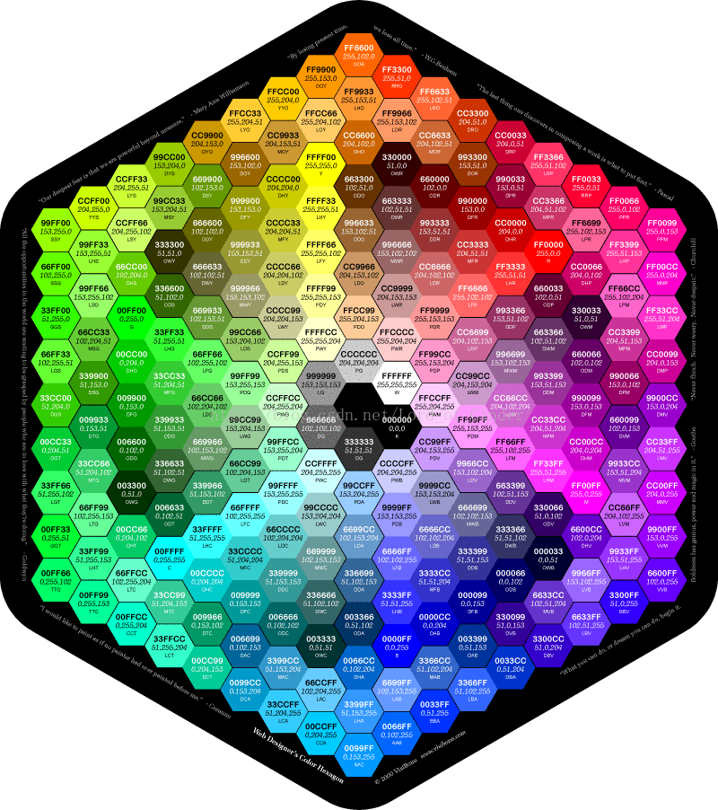
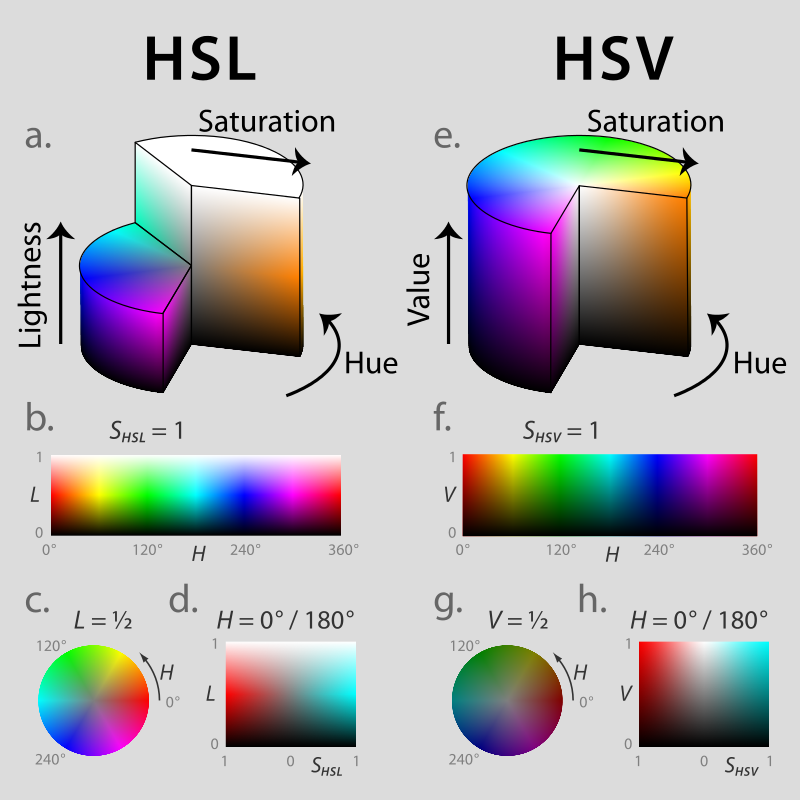

# 色彩表示与编码的技术博客

## 1.什么叫做颜色？

### 颜色或色彩是通过眼、脑和我们的生活经验所产生的一种对光的视觉效应。人对颜色的感觉不仅仅由光的物理性质所决定，还包含心理等许多因素，比如人类对颜色的感觉往往受到周围颜色的影响。有时人们也将物质产生不同颜色的物理特性直接称为颜色。

## 2.颜色是千变万化的，那我们要如何把千变万化的颜色表示出来并显示出来呢？这个时候就要用到颜色的编码了！

### RGB编码：RGB色彩模式是工业界的一种颜色标准，是通过对红(RED)、绿(GREEN)、蓝(BLUE)三个颜色通道的变化以及它们相互之间的叠加来得到各式各样的颜色的，RGB即是代表红、绿、蓝三个通道的颜色，这个标准几乎包括了人类视力所能感知的所有颜色，是目前运用最广的颜色系统之一。在电脑中，RGB的所谓“多少”就是指亮度，并使用整数来表示。通常情况下，RGB各有256级亮度，用数字表示为从0、1、2...直到255。

### 那接下来我们来了解下RGB编码的格式：颜色通常以16进制代码来表示，形式为#ABCDEF，前两位、中两位、后两位分别表示红、绿、蓝光的亮度。

## 3.关于色相、饱和度、亮度编码

### HSL即色相、饱和度、亮度（英语：Hue, Saturation, Lightness），又称HSL。HSV即色相、饱和度、明度（英语：Hue, Saturation, Value），又称HSB，其中B即英语：Brightness。

#### 色相（H）是色彩的基本属性，就是平常所说的颜色名称，如红色、黄色等。

#### 饱和度（S）是指色彩的纯度，越高色彩越纯，低则逐渐变灰，取0-100%的数值。 

#### 明度（V），亮度（L），取0-100%。 

### HSV模型通常用于计算机图形应用中。在用户必须选择一个颜色应用于特定图形元素各种应用环境中，经常使用HSV 色轮。在其中，色相表示为圆环；可以使用一个独立的三角形来表示饱和度和明度。典型的，这个三角形的垂直轴指示饱和度，而水平轴表示明度。在这种方式下，选择颜色可以首先在圆环中选择色相，在从三角形中选择想要的饱和度和明度。

### 看了笔者的这篇博客以后，你是否对颜色编码有了更全新的知识呢？
