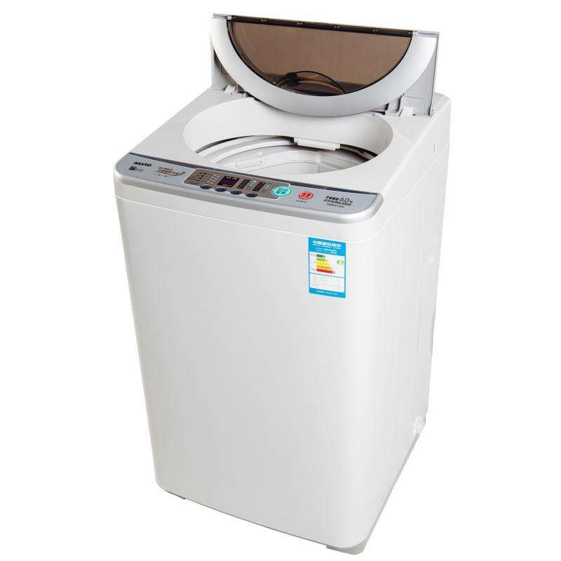

# 洗衣机算法设计

### 自顶向下，逐步求精：能够将复杂的问题分解开来。学会分解任务，因超级大分为大的、中的、小的、超小的，直到能用很直接的方法解决。

## 案例分析

首先我们先确定一个大致的方向（大概要做哪些事情）
~~~

SWITCH(pattern)

water in

FOR 1 to n
wash

water out

halt(success)

~~~

以上就是大致的方向，此时看起来仍有些复杂，但没有关系，我们采用自顶而下，逐步求精的方法。

~~~
### 1.第一步比价简单，读取模式即可
Read pattern
SWITCH(pattern)

### 2.第二步我们注水
Water in switch(open)
WHILE(water volume(enough));
water in switch(close)

### 3.浸泡
time counter(10 min)
then water out switch (open)
WHILE(water volume(0));
water out switch(close)

### 4.洗衣，看，这步看似很复杂的，我们采用自顶而下，逐步求精的方法，就可以大而化之。
FOR(1 to n)
time counter(5s)
motor run(left);
time counter(2s)
pause;
time counter(5s)
motor run(right);
time counter(reach the time of pattern )

### 5.此时洗衣算完成了，排水
water out  switch(open
WHILE(water volume (0));
water out switch(close)

### 6.成功收尾
halt (success)

~~~

总结：把上述的洗衣过程中一个个小问题的伪代码适当拼接，就可以拼成完整的正常洗衣过程伪代码了。所以说，运用Top-down的方法，再复杂的问题也能解决，只不过是时间问题!同时：“自顶向下”可以让我们快速入门、建立框架；而“逐步求精”则是让我们加深对知识的理解和运用能力。
养成“自顶向下，逐步求精”无疑是简化我们学习工作中的难题的宝贝！！
