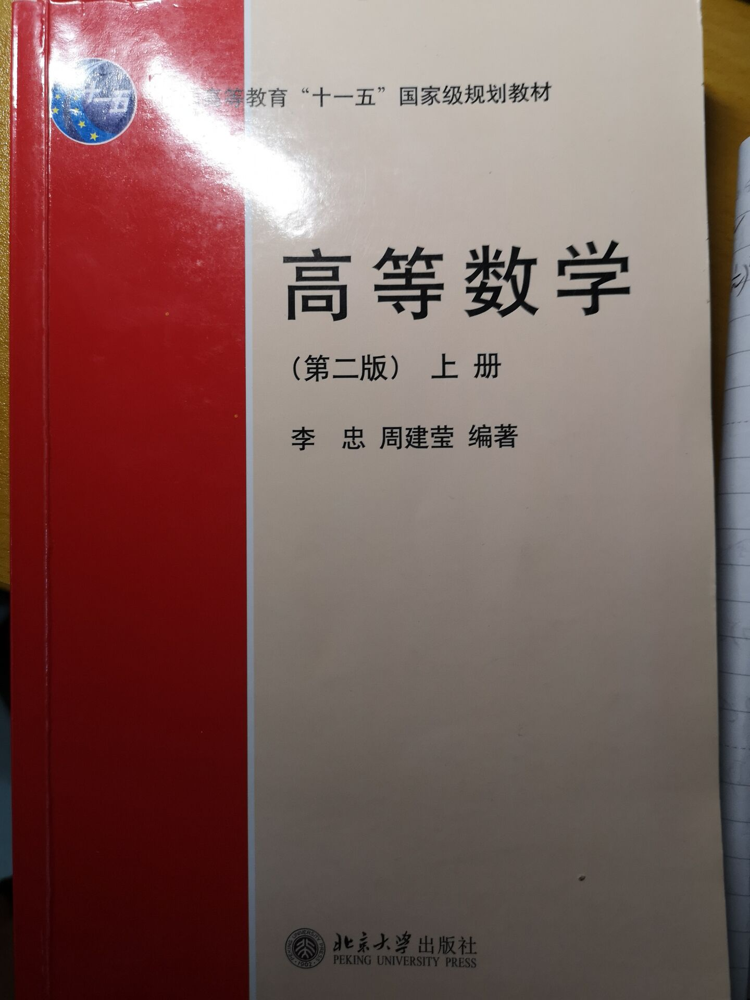
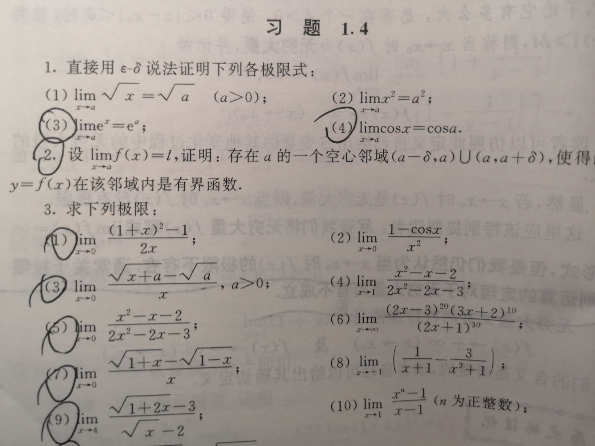
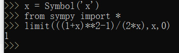
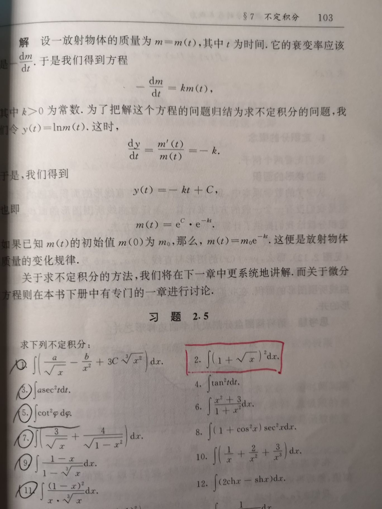
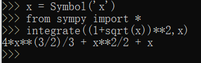
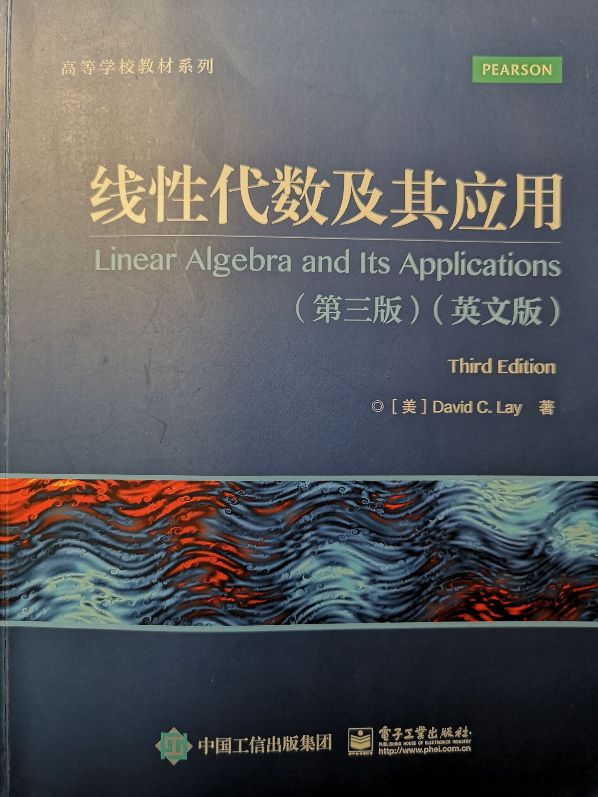
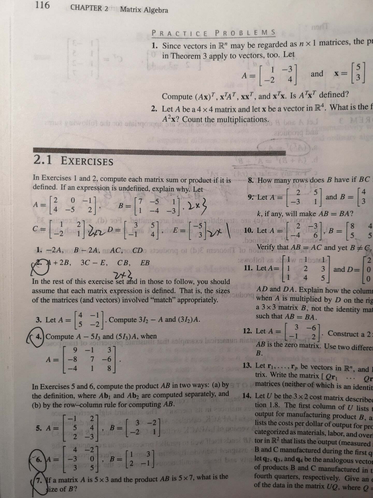
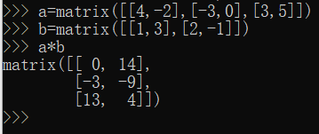
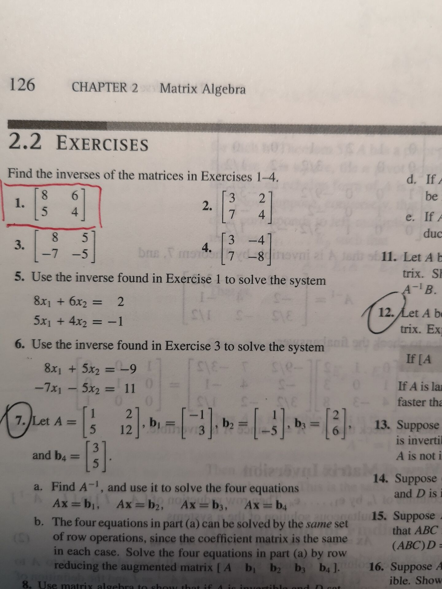
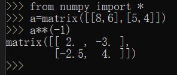

# python 编程实验报告:用 python 做计算器，做数学题
## 高等数学（使用北大版高等数学教材）

 

### question one:
#### 教材52页习题1.4第三题第一小问，如图所示
 

#### 求解过程如图：

答案符合标准，程序运行正常。

### question two:
#### 教材103页习题2.5第二题，如图所示

#### 求解过程如图：

答案符合标准，程序运行正常。

## 线性代数（使用高等学校教材系列线性代数及其应用第三版英文版）

### question one:
#### 教材116页习题2.1第六题，如图所示(求矩阵的乘法)

#### 求解过程如图：

答案符合标准，程序运行正常。

### question two:
#### 教材126页习题2.2第一题，如图所示（可逆矩阵）

#### 求解过程如图：

答案符合标准，程序运行正常。

### 实验总结
~~~
python真的是一种十分强大的语言，直接“简单粗暴”，真正的面向用户的语言，功能完备；而c语言与之相比则偏于结构化.这次实验让我意识到了j交互式编程的好处，并使我对计算机语言有了更好的认识。
~~~

