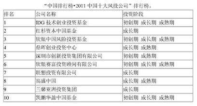

# IT风投之我见

## IT行业风投的概念：
~~~
风险投资（Venture Capital）简称是VC，广义的风险投资泛指一切具有高风险、高潜在收益的投资；狭义的风险投资是指以高新技术为基础，生产与经营技术密集型产品的投资。也有定义称风险投资是由职业金融家投入到新兴的、迅速发展的、具有巨大竞争潜力的企业中一种权益资本。
~~~

## IT行业风投的特点

~~~
1.IT行业为新兴技术,老牌技术的市场已经饱和，虽然可能较为稳定，但是伴随而来的还有低机遇，IT行业更容易引起资本家的关注。
2.IT行业的风投近年来基本上占据了风投的半壁江山,展示了IT行业的强大魅力。
3.IT风投同时也具备风险高的特点，但其带来的收益可能会很大。
~~~
## IT行业著名的风投公司

~~~
Sequoia Capital；
NEA（New Enterprise Associates） ;
Mayfield ;
KPCB（Kleiner，Perkins，Caufield &Byers）;
新浪网、阿里巴巴集团、土巴兔、酒仙网、万学教育、京东商城、文思创新、唯品会、聚美优品、豆瓣网、诺亚财富、高德软件、乐蜂网、奇虎360、乾照光电、焦点科技、大众点评网、美团网 
~~~

## IT风投于中国
~~~
Sequoia Capital在中国的几个投资都十分成功，另外，NEA等风头行业的巨鳄，也在争先恐后地进入中国，其中，KPCB在进入中国前，还进行了为期两年的调查，做好了详细的准备，由此可见风投市场对中国的看好。
~~~

## IT风投对IT行业创业者的影响
~~~
对于许多行业特别是IT这个行业，如果要求创业者将自己一辈子的积蓄全部拿出来创业，很多人可能会知难而退，更何况最喜欢创业的年轻人恰恰是积蓄最少的群体。若这一个最有生命力的群体的创造力得不到解放，IT行业发展将会大大减速。银行贷款？这种方式虽然可行，但对于创业者来说仍然具有很大风险，而风险投资，不需要抵押，创业失败了不需要还，这种机制可以给创业者分去资金上的负担，全心全意投入到公司的发展中去，可谓是创业者的救命稻草。
~~~

## IT风投的一些经典案例

~~~
1.阿里巴巴，通过风险投资挺过创业期，撑过互联网寒冬，最终发展成如今的巨大规模
2.四叶草恋爱学院，仍在发展，但其创新意义引来了风险投资人的青睐
3.重庆的陈富云为服装业想到一个名为“数码试衣”的智能互联化营销模式，帮助其实现“以销定产”，大大降低库存积压，由此引来一家英国风投公司的2000万英镑先期投资
~~~
## 以下是我在阅读了《浪潮之巅》觉得说的很好的一段话
~~~
《浪潮之巅》第13章 风险投资 在最后提到：虽然风险投资的目的是追求高利润，但这些高利润是它们应得的报酬。我对风险投资家的敬意远远高于对华尔街，因为风险投资对社会有很大的正面影响，而华尔街经常会起负面作用。风险投资通常是为创业者雪中送炭，不管创业成功与否，它们都在促进技术进步和产业结构的更新。而华尔街做的事，常常是将一个口袋里的钱放到另一个口袋里，并从中攫取巨大的财富。
~~~