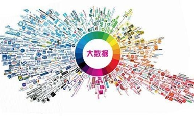

# 互联网时代的热点领域选择、营销方法

## 时下网络安全领域的四大热点领域

### 人工智能（Artificial intelligence）、区块链（Blockchain）、云（Cloud）和大数据（bigData）是时下网络安全领域的四大热点领域，也被称为网络安全的ABCD。

1.人工智能是计算机科学的一个分支，它企图了解智能的实质，并生产出一种新的能以人类智能相似的方式做出反应的智能机器，该领域的研究包括机器人、语言识别、图像识别、自然语言处理和专家系统等。人工智能从诞生以来，理论和技术日益成熟，应用领域也不断扩大，可以设想，未来人工智能带来的科技产品，将会是人类智慧的“容器”。人工智能可以对人的意识、思维的信息过程的模拟。人工智能不是人的智能，但能像人那样思考、也可能超过人的智能。人工智能是一门极富挑战性的科学，从事这项工作的人必须懂得计算机知识，心理学和哲学。人工智能是包括十分广泛的科学，它由不同的领域组成，如机器学习，计算机视觉等等，总的说来，人工智能研究的一个主要目标是使机器能够胜任一些通常需要人类智能才能完成的复杂工作。

2.区块链是分布式数据存储、点对点传输、共识机制、加密算法等计算机技术的新型应用模式。

狭义来讲，区块链是一种按照时间顺序将数据区块以顺序相连的方式组合成的一种链式数据结构， 并以密码学方式保证的不可篡改和不可伪造的分布式账本。

广义来讲，区块链技术是利用块链式数据结构来验证与存储数据、利用分布式节点共识算法来生成和更新数据、利用密码学的方式保证数据传输和访问的安全、利用由自动化脚本代码组成的智能合约来编程和操作数据的一种全新的分布式基础架构与计算方式。

3.云技术是指在广域网或局域网内将硬件、软件、网络等系列资源统一起来，实现数据的计算、储存、处理和共享的一种托管技术。云计算技术将变成重要支撑。技术网络系统的后台服务需要大量的计算、存储资源，如视频网站、图片类网站和更多的门户网站。伴随着互联网行业的高度发展和应用，将来每个物品都有可能存在自己的识别标志，都需要传输到后台系统进行逻辑处理，不同程度级别的数据将会分开处理，各类行业数据皆需要强大的系统后盾支撑，只能通过云计算来实现。

4.大数据（big data），指无法在一定时间范围内用常规软件工具进行捕捉、管理和处理的数据集合，是需要新处理模式才能具有更强的决策力、洞察发现力和流程优化能力的海量、高增长率和多样化的信息资产。大数据技术的战略意义不在于掌握庞大的数据信息，而在于对这些含有意义的数据进行专业化处理。换而言之，如果把大数据比作一种产业，那么这种产业实现盈利的关键，在于提高对数据的“加工能力”，通过“加工”实现数据的“增值”。

## 如何让自己在新的环境构架中正确进行精准的全面营销(即优良的营销方法)

### 1.抓住超前消费:

超前消费就是指目前的收入水平不足以购买现在所需的产品或服务，以贷款、分期付款，预支等形式进行消费。超前消费可以让用户提前享受到未来所支付的服务。

而在互联网时代，我们的超前消费也变得更加方便、简单。目前，很多平台都推出了超前消费的形式。例如：支付宝推出的花呗，京东推出的京东白条，天猫的天猫分期，唯品会的唯品花等等。这些都是看清了在互联网时代人们的消费行为，尤其是年轻人的消费行为。所以说在互联网时代，我们应该抓住超前消费这一热点。

### 2.抓住儿童经济

儿童经济是以3-14岁的孩子为需求主体，形成的包括儿童用品，儿童玩具、亲子娱乐、教育、医疗等消费需求。孩子是家庭的未来，每个家长都希望自己的孩子用最好的，所以儿童的消费所产生的经济效益是巨大的。而目前针对儿童所形成的互联网模式还没有一个完整的的体系。所以对于我们来说，这是一个好的发展机会。

### 3.抓住女性消费热点

“最败家的就是女人”“永远不要和一个女人出去逛街”“女人要对自己更好一点”这些话在目前处处皆是，然而对于商家来说，这无疑是一个好的现象，女生的购物狂潮，不再是传统的春节购物，已经体现在三八节，五一，十一，双十一，双十二，圣诞节等节日，都成为女人疯狂购物的理由。不止是女性产品，所附带的日常用品，也成为女人购物的对象，各类商品成直线上升趋势。如果企业抓住了女性这一消费群体，那么也就抓住了成功的关键。

### 4.合理采用各种营销方式

饥饿营销是指商品提供者有意调低产量，以期达到调控供求关系、制造供不应求“假象”、以维护产品形象并维持商品较高售价和利润率的营销策略。

口碑营销是指企业在品牌建立过程中，通过客户间的相互交流将自己的产品信息或者品牌传播开来。

借势营销通过创意将产品附着在有巨大传播力大家众所周知的热点事件上，很容易就会获得大量传播。

病毒营销是利用公众的积极性和人际网络，让营销信息像病毒一样传播和扩散，营销信息被快速复制传向数以万计、数以百万计的观众，它能够像病毒一样深入人脑，快速复制，迅速传播，将信息短时间内传向更多的受众。

跨界营销，可以说是现阶段除了互联网思维和饥饿营销以外被炒得最热的词汇了。两个看似毫不搭噶的品牌，根据各自的特点和优势，相互契合渗透，优势互补，达到1+1>2的效果。

### 5.打造以健康养生的经营模式

现代人的生活压力越来越大，面对快速的生活节奏和高强度的工作，大多数上班族都出现了“亚健康”的问题。随着人们收入的增加，健康意识的不断提高，也越来越注意养生，而养生不再是老年人的专属，而越来越向年轻化发展。人们对健康养生的需求也向多样性，全面性发展。而随着互联网的发展，年轻人也越来越多地倾向于互联网方式的消费。

~~~
互联网所带来的巨大经济效益是不容忽视的，在互联网时代，企业需要有敏感的嗅觉。因为抓住了人们的消费心理，就等于抓住了成功。
~~~

